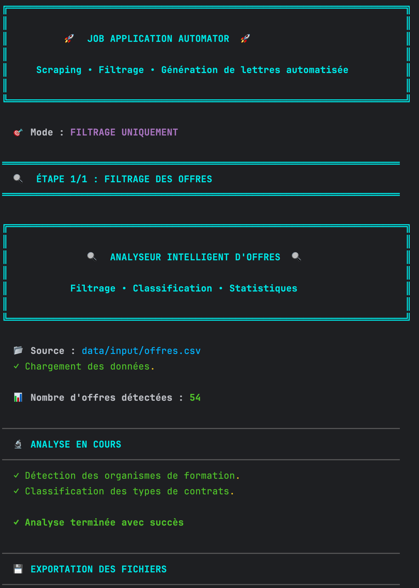
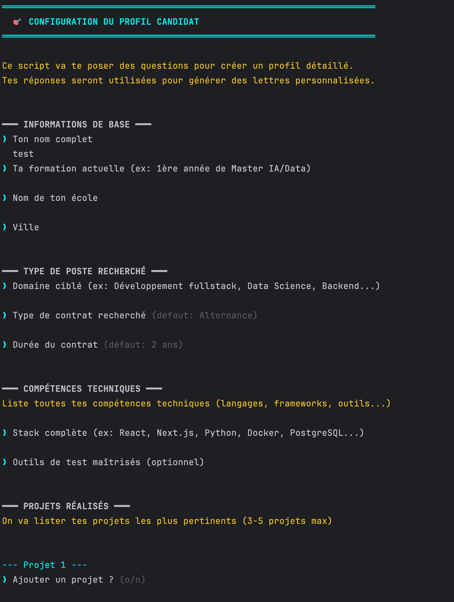
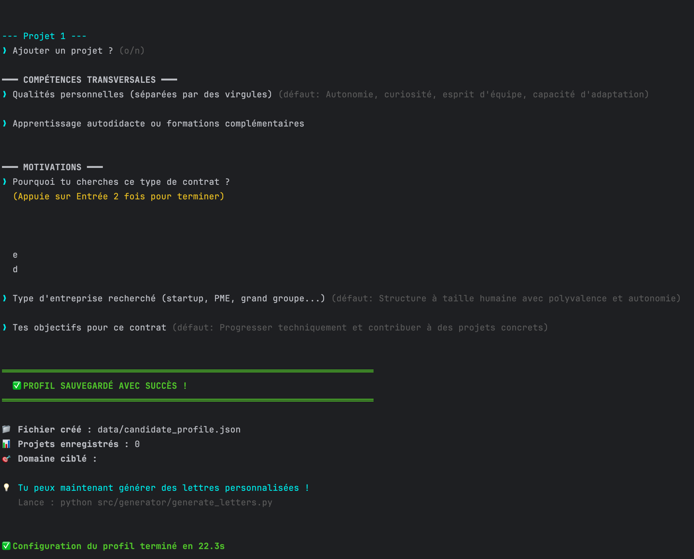
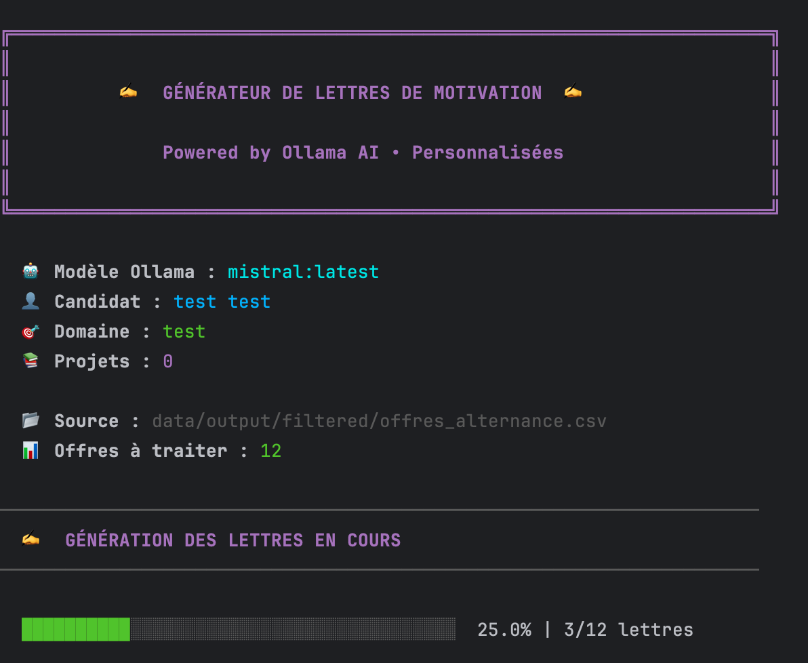

<p align="right">
  <a href="./README.md">🇫🇷 Version Française</a>
</p>

# 🚀 Job Application Automator

Automate your job search with a complete pipeline: job scraping, intelligent filtering, and AI-powered personalized cover letter generation.

---

## 📋 Table of Contents

- [Features](#-features)
- [Architecture](#-architecture)
- [Installation](#-installation)
- [Configuration](#-configuration)
- [Usage](#-usage)
- [Project Structure](#-project-structure)
- [Technologies](#-technologies)

---

## ✨ Features

### 🕷️ **Smart Scraping**
- Automatic extraction of job offers  
- Captcha handling with progress saving  
- Parallel scraping for better performance  
- 404 page detection and skipping  
- Automatic resume after interruption  

### 🔍 **Advanced Filtering**
- Detects and excludes training institutions  
- Automatically classifies offers by contract type (Full-time, Internship, Apprenticeship, Freelance)  
- Generates detailed statistics and visual reports  
- Exports filtered data as CSV  

### ✍️ **AI Cover Letter Generation**
- Personalized letters generated with **Ollama**  
- Automatic selection of relevant projects  
- Adapts tone and content to company and job description  
- Exports letters as individual text files  

---

## 🏗️ Architecture
```
┌─────────────┐      ┌─────────────┐      ┌─────────────┐
│   Scraper   │ ───> │   Filter    │ ───> │  Generator  │
│  (Node.js)  │      │  (Python)   │      │  (Python)   │
└─────────────┘      └─────────────┘      └─────────────┘
      │                     │                     │
      ▼                     ▼                     ▼
  Raw CSV            Filtered CSV           Cover Letters
```
**Full pipeline:**
1. **Scraping** → Extract job offers from job boards  
2. **Filtering** → Clean and classify job data  
3. **Generation** → Create personalized AI cover letters  

---

## 🛠️ Installation

### Requirements

- **Node.js** ≥ 16.x  
- **Python** ≥ 3.9  
- **Ollama** (for letter generation)

### Installation Steps

```bash
# 1. Clone the repository
git clone https://github.com/your-username/job-application-automator.git
cd job-application-automator

# 2. Install Node.js dependencies
npm install

# 3. Install Python dependencies
pip install -r requirements.txt

# 4. Install and start Ollama
# Download from https://ollama.com
ollama pull mistral:latest

#launch the interactive setup
python src/main.py
```

---
## ⚙️ Configuration

### 1. Environment Variables

Create a `.env` file at the root of the project:

```env
# Browser configuration
BROWSER_EXECUTABLE=/path/to/chromium
HEADLESS=false

# Site configuration
SITE_BASE_URL=https://example-job-site.com
SITE_SEARCH_PATH=/jobs/search
TYPE_OFFRE=developer
LOCALISATION=Paris

# Output configuration
CSV_OUTPUT=data/input/job_offers.csv
FILTERED_FOLDER=data/output/filtered
LETTERS_FOLDER=data/output/letters

# Scraper configuration
PARALLEL_TABS=2
MAX_PAGES=10

# AI Model
OLLAMA_MODEL=llama3.2:latest
```

### 2. Candidate Profile Setup

Launch the interactive setup:

```bash
python src/main.py setup
```

Or directly:

```bash
python src/generator/setup_profile.py
```

This step creates a `data/candidate_profile.json` file containing:
- Personal information  
- Education and skills  
- Completed projects  
- Motivations and goals  

---

## 🚀 Usage

### Interactive Mode

Launch the main menu:

```bash
python src/main.py
```

Available menu:
```
1. full     → Full pipeline (scraping + filtering + letters)
2. scrape   → Scraping only
3. filter   → Offer filtering
4. letters  → Letter generation
5. setup    → Profile setup
```

### Command Line Mode

```bash
# Full pipeline
python src/main.py full

# Scraping only
python src/main.py scrape

# Filtering only
python src/main.py filter

# Letter generation only
python src/main.py letters

# Profile setup
python src/main.py setup
```

### Usage Examples

**Scraping 50 offers:**
```bash
# Set MAX_PAGES=5 in .env (5 pages × 10 offers)
python src/main.py scrape
```

**Generate letters for a specific CSV file:**
```bash
python src/generator/generate_letters.py data/output/filtered/offres_cdi.csv
```

---

## 📁 Project Structure

```
job-application-automator/
├── src/
│   ├── scraper/
│   │   └── scrape.js              # Puppeteer scraper
│   ├── analyzer/
│   │   └── filter_offers.py       # Filtering and classification
│   ├── generator/
│   │   ├── setup_profile.py       # Profile setup
│   │   └── generate_letters.py    # AI letter generation
│   └── main.py                    # Main entry point
├── data/
│   ├── input/                     # Raw scraped CSV files
│   ├── output/
│   │   ├── filtered/              # Filtered CSVs by type
│   │   └── letters/               # Generated letters
│   └── candidate_profile.json     # Candidate profile
├── .env                           # Configuration (to create)
├── .gitignore
├── package.json
├── requirements.txt
└── README.md
```

---

## 🔧 Technologies

### Backend
- **Node.js** - Runtime for the scraper  
- **Puppeteer** - Browser automation  
- **Python 3** - Data processing and generation  

### Main Libraries

**JavaScript:**
- `puppeteer-extra` - Advanced scraping  
- `puppeteer-extra-plugin-stealth` - Anti-bot evasion  
- `json2csv` - CSV export  
- `cli-progress` - Progress bars  

**Python:**
- `pandas` - Data manipulation  
- `python-dotenv` - Environment variable management  
- `ollama` - AI text generation  

---

## 📊 Example Results

### After scraping (100 offers)
```
├── data/input/job_offers.csv (100 raw offers)
```

### After filtering
```
├── data/output/filtered/
│   ├── offres_alternance.csv      (25 offers)
│   ├── offres_cdi.csv             (40 offers)
│   ├── offres_stage.csv           (15 offers)
│   ├── offres_cdd.csv             (10 offers)
│   └── offres_ecoles.csv          (10 offers - filtered)
```

### After letter generation
```
├── data/output/letters/
│   ├── letter_Company1_Developer.txt
│   ├── letter_Company2_DataScientist.txt
│   └── ... (25 letters)
```

---

## ⚡ Performance

- **Scraping:** ~2–3 offers/second (parallel mode)  
- **Filtering:** ~500 offers/second  
- **Letter generation:** ~10–15 seconds/letter (depends on AI model)  

**Full pipeline (100 offers):** ~3–5 minutes  

---

## 🛡️ Error Handling

### Captcha Detected
The script automatically stops and saves progress. To resume:
1. Solve the captcha manually in the browser  
2. Wait 2–3 minutes  
3. Restart the script → it will resume automatically  

### Interruption (Ctrl+C)
Progress is automatically saved in:
- `data/.scraper_progress.json`  
- `data/scraper.log`  

---

## ⚠️ Disclaimer

This tool is provided for educational purposes only.  
Make sure to respect the terms of service of the websites you scrape and comply with local automation regulations.

---

# Presentation Menu

### 1. Main Menu
  

---

### 2. Scraping Menu
  

---

### 3. Results Filtering
  

---

### 4. Results Filtering (Part 2)
  

---

### 5. Candidate Profile Adjustment
  

---

### 6. Candidate Profile Adjustment (Part 2)
  

---

### 7. Cover Letter Generation
  

---
**Happy job hunting! 🎯**

**Happy job hunting! 🎯**

