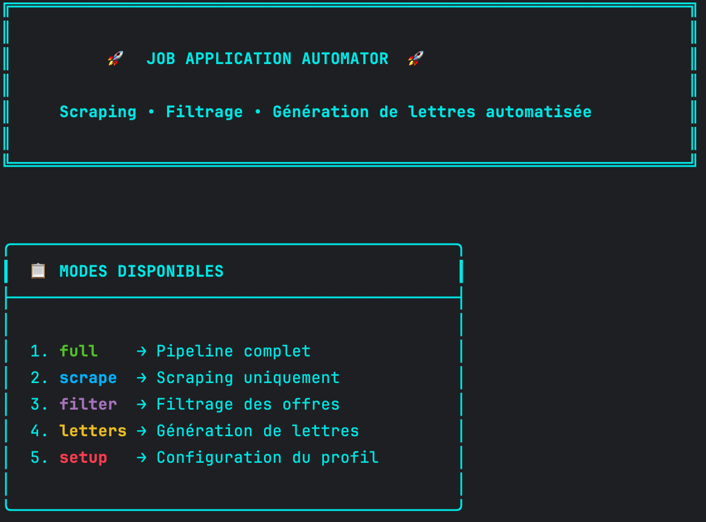
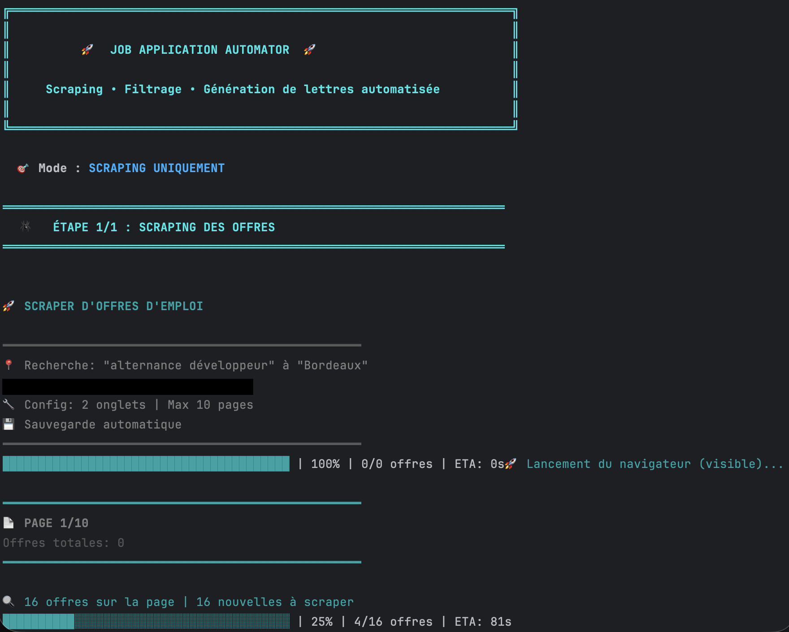
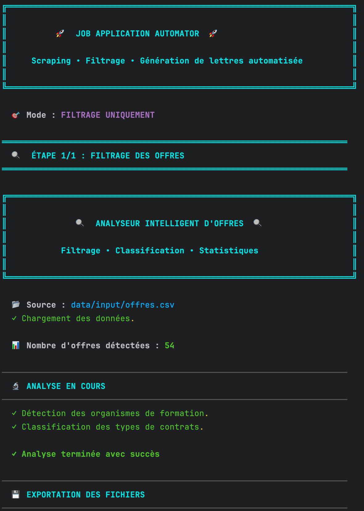
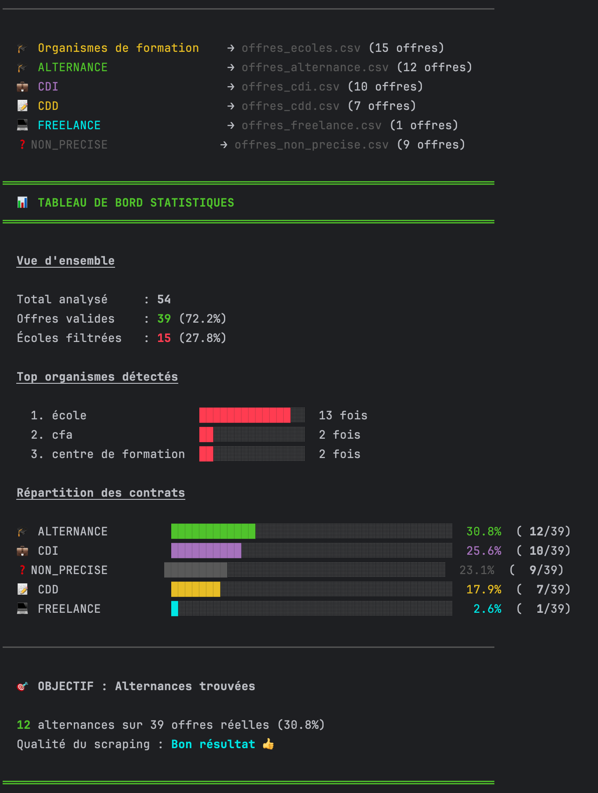
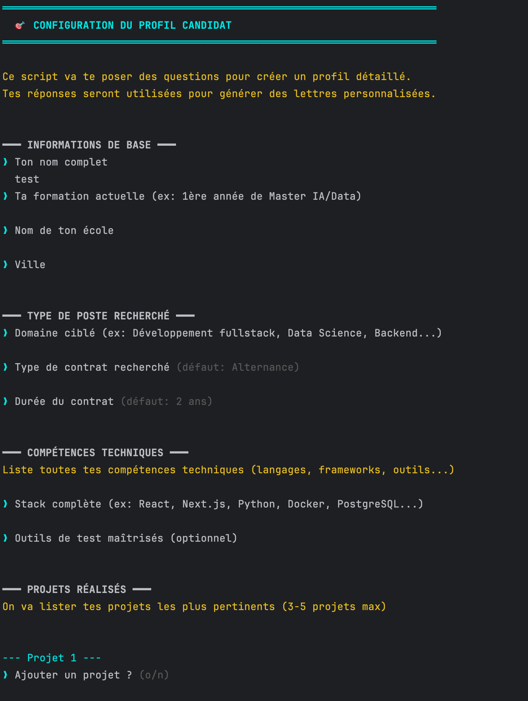
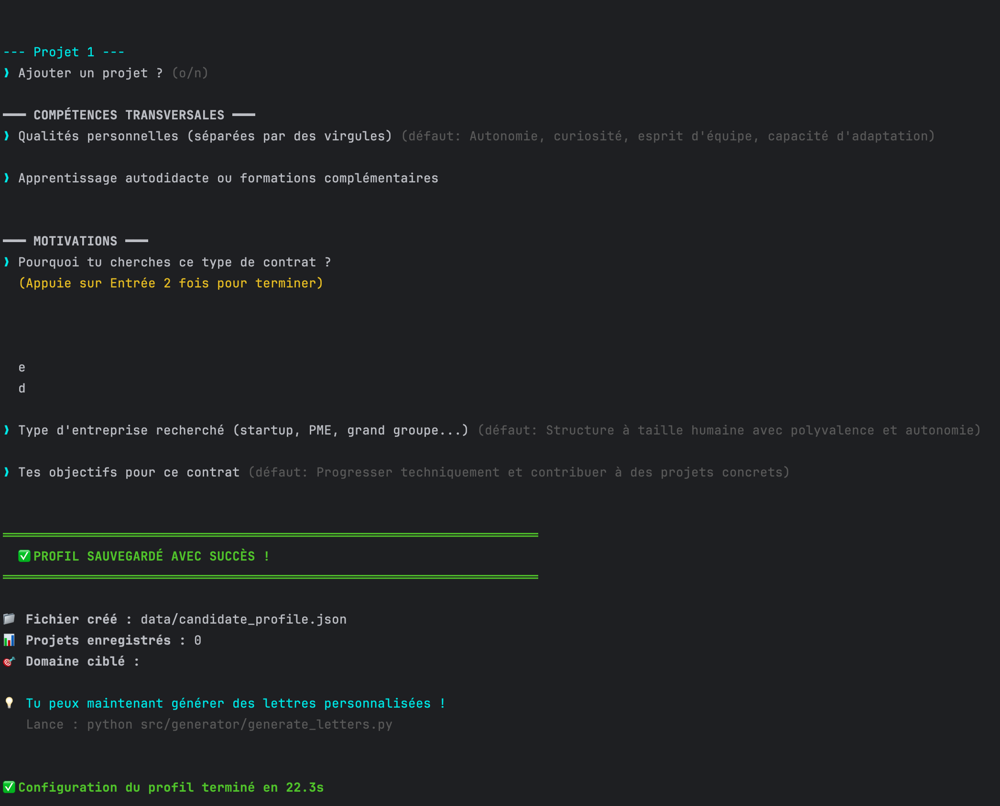
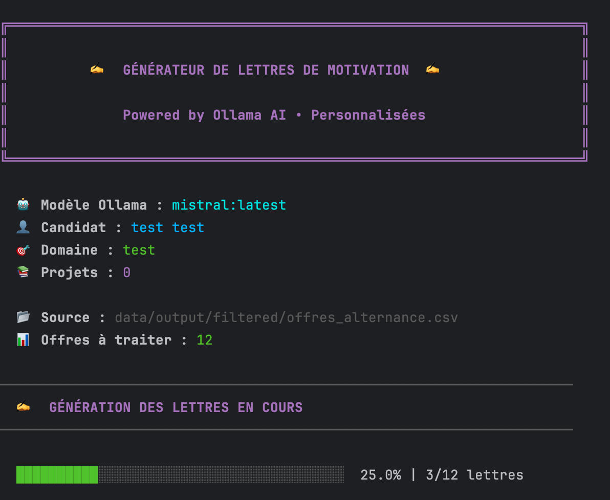

# 🚀 Job Application Automator

Automatisez votre recherche d'emploi avec un pipeline complet : scraping d'offres, filtrage intelligent et génération de lettres de motivation personnalisées par IA.

---

## 📋 Table des matières

- [Fonctionnalités](#-fonctionnalités)
- [Architecture](#-architecture)
- [Installation](#-installation)
- [Configuration](#-configuration)
- [Utilisation](#-utilisation)
- [Structure du projet](#-structure-du-projet)
- [Technologies](#-technologies)

---

## ✨ Fonctionnalités

### 🕷️ **Scraping intelligent**
- Extraction automatique des offres d'emploi
- Gestion des captchas avec sauvegarde de progression
- Scraping parallèle pour plus de rapidité
- Détection et skip des pages 404
- Reprise automatique après interruption

### 🔍 **Filtrage avancé**
- Détection et exclusion des organismes de formation
- Classification automatique par type de contrat (CDI, CDD, Alternance, Stage, Freelance)
- Statistiques détaillées et rapports visuels
- Export des données filtrées en CSV

### ✍️ **Génération de lettres de motivation**
- Lettres personnalisées via IA (Ollama)
- Sélection automatique des projets pertinents
- Adaptation au poste et à l'entreprise
- Export en fichiers texte individuels

---

## 🏗️ Architecture

```
┌─────────────┐      ┌─────────────┐      ┌─────────────┐
│   Scraper   │ ───> │   Filter    │ ───> │  Generator  │
│  (Node.js)  │      │  (Python)   │      │  (Python)   │
└─────────────┘      └─────────────┘      └─────────────┘
      │                     │                     │
      ▼                     ▼                     ▼
  Raw CSV            Filtered CSV           Cover Letters
```

**Pipeline complet :**
1. **Scraping** → Extraction des offres depuis un site d'emploi
2. **Filtrage** → Nettoyage et classification des données
3. **Génération** → Création de lettres de motivation personnalisées

---

## 🛠️ Installation

### Prérequis

- **Node.js** ≥ 16.x
- **Python** ≥ 3.9
- **Ollama** (pour la génération de lettres)

### Étapes d'installation

```bash
# 1. Clone le repository
git clone https://github.com/votre-username/job-application-automator.git
cd job-application-automator

# 2. Installe les dépendances Node.js
npm install

# 3. Installe les dépendances Python
pip install -r requirements.txt

# 4. Installe et démarre Ollama (pour la génération de lettres)
# Télécharge depuis https://ollama.com
ollama pull llama3.2:latest  # ou un autre modèle
```

---

## ⚙️ Configuration

### 1. Variables d'environnement

Crée un fichier `.env` à la racine du projet :

```env
# Browser configuration
BROWSER_EXECUTABLE=/path/to/chromium
HEADLESS=false

# Site configuration
SITE_BASE_URL=https://example-job-site.com
SITE_SEARCH_PATH=/jobs/search
TYPE_OFFRE=developer
LOCALISATION=Paris

# Output configuration
CSV_OUTPUT=data/input/job_offers.csv
FILTERED_FOLDER=data/output/filtered
LETTERS_FOLDER=data/output/letters

# Scraper configuration
PARALLEL_TABS=2
MAX_PAGES=10

# AI Model
OLLAMA_MODEL=llama3.2:latest
```

### 2. Configuration du profil candidat

Lance la configuration interactive :

```bash
python src/main.py setup
```

Ou directement :

```bash
python src/generator/setup_profile.py
```

Cette étape crée un fichier `data/candidate_profile.json` avec :
- Informations personnelles
- Formation et compétences
- Projets réalisés
- Motivations et objectifs

---

## 🚀 Utilisation

### Mode interactif

Lance le menu principal :

```bash
python src/main.py
```

Menu disponible :
```
1. full     → Pipeline complet (scraping + filtrage + lettres)
2. scrape   → Scraping uniquement
3. filter   → Filtrage des offres
4. letters  → Génération de lettres
5. setup    → Configuration du profil
```

### Mode ligne de commande

```bash
# Pipeline complet
python src/main.py full

# Scraping seul
python src/main.py scrape

# Filtrage seul
python src/main.py filter

# Génération de lettres seule
python src/main.py letters

# Configuration du profil
python src/main.py setup
```

### Exemples d'utilisation

**Scraping de 50 offres :**
```bash
# Configure MAX_PAGES=5 dans .env (5 pages × 10 offres)
python src/main.py scrape
```

**Générer des lettres pour un fichier CSV spécifique :**
```bash
python src/generator/generate_letters.py data/output/filtered/offres_cdi.csv
```

---

## 📁 Structure du projet

```
job-application-automator/
├── src/
│   ├── scraper/
│   │   └── scrape.js              # Scraper Puppeteer
│   ├── analyzer/
│   │   └── filter_offers.py       # Filtrage et classification
│   ├── generator/
│   │   ├── setup_profile.py       # Configuration du profil
│   │   └── generate_letters.py    # Génération de lettres IA
│   └── main.py                    # Point d'entrée principal
├── data/
│   ├── input/                     # CSV brut du scraping
│   ├── output/
│   │   ├── filtered/              # CSV filtrés par type
│   │   └── letters/               # Lettres générées
│   └── candidate_profile.json     # Profil du candidat
├── .env                           # Configuration (à créer)
├── .gitignore
├── package.json
├── requirements.txt
└── README.md
```

---

## 🔧 Technologies

### Backend
- **Node.js** - Runtime pour le scraper
- **Puppeteer** - Automatisation du navigateur
- **Python 3** - Traitement et génération

### Librairies principales

**JavaScript :**
- `puppeteer-extra` - Scraping avancé
- `puppeteer-extra-plugin-stealth` - Contournement anti-bot
- `json2csv` - Export CSV
- `cli-progress` - Barres de progression

**Python :**
- `pandas` - Manipulation de données
- `python-dotenv` - Gestion des variables d'environnement
- `ollama` - Génération de texte par IA

---

## 📊 Exemple de résultats

### Après scraping (100 offres)
```
├── data/input/job_offers.csv (100 offres brutes)
```

### Après filtrage
```
├── data/output/filtered/
│   ├── offres_alternance.csv      (25 offres)
│   ├── offres_cdi.csv             (40 offres)
│   ├── offres_stage.csv           (15 offres)
│   ├── offres_cdd.csv             (10 offres)
│   └── offres_ecoles.csv          (10 offres - filtrées)
```

### Après génération
```
├── data/output/letters/
│   ├── lettre_Entreprise1_Developpeur.txt
│   ├── lettre_Entreprise2_DataScientist.txt
│   └── ... (25 lettres)
```

---

## ⚡ Performance

- **Scraping** : ~2-3 offres/seconde (mode parallèle)
- **Filtrage** : ~500 offres/seconde
- **Génération** : ~10-15 secondes/lettre (dépend du modèle IA)

**Pipeline complet (100 offres) :** ~3-5 minutes

---

## 🛡️ Gestion des erreurs

### Captcha détecté
Le script s'arrête automatiquement et sauvegarde la progression. Pour reprendre :
1. Résous le captcha manuellement dans le navigateur
2. Attends 2-3 minutes
3. Relance le script → reprise automatique

### Interruption (Ctrl+C)
Progression sauvegardée automatiquement dans :
- `data/.scraper_progress.json`
- `data/scraper.log`

---


## ⚠️ Disclaimer

Cet outil est fourni à des fins éducatives. Assurez-vous de respecter les conditions d'utilisation des sites que vous scrapez et les réglementations locales sur l'automatisation.

---


## Presentation Menu

### 1. Menu Principal
  

---

### 2. Menu Scraping
  

---

### 3. Filtrage des Résultats
  

---

### 3. Filtrage des Résultats 2
  

---

### 5. Adaptation du Profil Candidat
  

---

### 5. Adaptation du Profil Candidat 2
  

---

### 5. Génération de lettres de motivation
  

---
**Happy job hunting! 🎯**